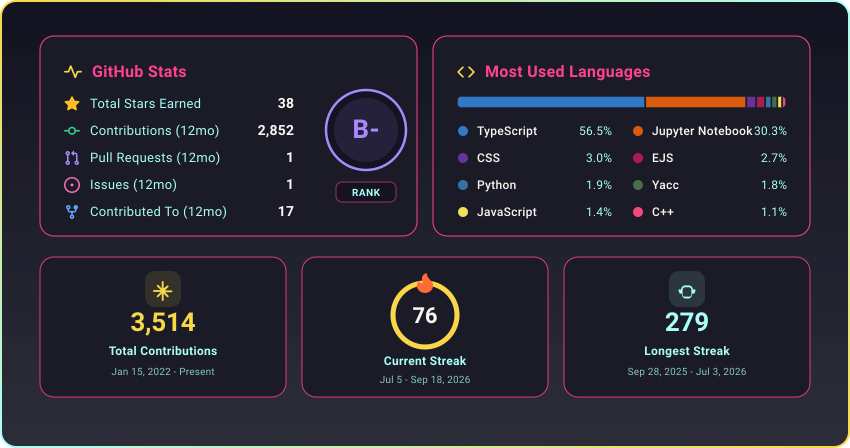

  
    

  

  

 

  <table border="0">
    <tr>
      <td>
        
      </td>
      <td>
        
      </td>
      <td>
        
      </td>
      <td>
        
      </td>
      <td>
        
      </td>
      <td>
        
      </td>
    </tr>
  </table>

 

 

  

 

  

  

  
  

 

 
 

  

 
 

  

